# Sales Forecasting using Machine Learning
## A Comparative Study of Linear Regression & Random Forest Regressor

---

### Submitted By
**Project Type:** Internal Project  
**Domain:** Machine Learning / Data Science  
**Dataset:** Superstore Sales Dataset (Kaggle)  
**Tools:** Python, Pandas, NumPy, Scikit-learn, Matplotlib, Seaborn, Jupyter Notebook

---

## Table of Contents

1. [Abstract](#1-abstract)
2. [Introduction](#2-introduction)
3. [Literature Review](#3-literature-review)
4. [Dataset Description](#4-dataset-description)
5. [Methodology](#5-methodology)
6. [Data Preprocessing](#6-data-preprocessing)
7. [Feature Engineering](#7-feature-engineering)
8. [Exploratory Data Analysis](#8-exploratory-data-analysis)
9. [Model Building](#9-model-building)
10. [Hyperparameter Tuning](#10-hyperparameter-tuning)
11. [Cross-Validation](#11-cross-validation)
12. [Model Comparison & Results](#12-model-comparison--results)
13. [Feature Importance Analysis](#13-feature-importance-analysis)
14. [Residual Analysis](#14-residual-analysis)
15. [Business Insights & Recommendations](#15-business-insights--recommendations)
16. [Conclusion](#16-conclusion)
17. [Future Scope](#17-future-scope)
18. [References](#18-references)
19. [Figures Gallery](#19-figures-gallery)
20. [Frontend Dashboard](#20-frontend-dashboard)

---

## 1. Abstract

This project develops a complete end-to-end Machine Learning pipeline for sales forecasting using the Superstore Sales Dataset — a real-world retail transaction dataset containing 9,994 records spanning four years (2014–2017) across multiple US regions and product categories. Two regression models are compared: Linear Regression as a baseline and Random Forest Regressor as the advanced model. The models are evaluated using Mean Absolute Error (MAE), Root Mean Squared Error (RMSE), and R² Score metrics. Results demonstrate that the **Tuned Random Forest Regressor significantly outperforms Linear Regression**, achieving an MAE of $85.62 (vs. $243.05), RMSE of $496.07 (vs. $821.99), and R² of 0.5834 (vs. -0.1439). Feature importance analysis reveals that **Profit, Discount, and Sub-Category** are the top predictors of sales, providing actionable business insights for retail decision-making.

---

## 2. Introduction

### 2.1 Background

Sales forecasting is a critical business function that enables organizations to make informed decisions about inventory management, resource allocation, marketing strategies, and financial planning. Accurate sales predictions help businesses minimize waste, optimize supply chains, and maximize revenue.

Traditional forecasting methods rely on time-series analysis and statistical models, but Machine Learning approaches have shown superior performance by capturing complex, non-linear relationships between multiple variables simultaneously.

### 2.2 Problem Statement

Given a retail dataset with transactional information including order details, shipping information, customer segments, product categories, and financial metrics, the objective is to **predict the sales amount** for each transaction using machine learning models and determine which model provides the most accurate predictions.

### 2.3 Objectives

1. To explore, clean, and preprocess the Superstore Sales Dataset for ML readiness.
2. To extract meaningful features through feature engineering including temporal variables.
3. To perform Exploratory Data Analysis (EDA) with rich visualisations.
4. To build and evaluate a Linear Regression model as a baseline predictor.
5. To build and train a Random Forest Regressor for improved accuracy.
6. To apply hyperparameter tuning via GridSearchCV for model optimisation.
7. To validate model performance using 5-fold cross-validation.
8. To compare all models using MAE, RMSE, and R² evaluation metrics.
9. To perform feature importance analysis for business insight extraction.
10. To document all findings in a professional, structured project report.

---

## 3. Literature Review

### 3.1 Machine Learning in Sales Forecasting

Machine learning has been increasingly adopted for demand forecasting and sales prediction across industries. Research has demonstrated that ensemble methods, particularly Random Forests, outperform traditional regression approaches for retail data due to the non-linear relationships inherent in consumer purchasing behavior (Huang et al., 2020).

### 3.2 Linear Regression

Linear Regression is one of the simplest and most interpretable regression algorithms. It models the relationship between features and target as a linear combination:

**y = β₀ + β₁x₁ + β₂x₂ + ... + βₙxₙ + ε**

While computationally efficient, Linear Regression assumes linearity, homoscedasticity, and feature independence — assumptions often violated in real-world retail data.

### 3.3 Random Forest Regressor

Random Forest is an ensemble learning method that constructs multiple decision trees during training and outputs the average prediction. Key advantages include:
- Handles non-linear relationships naturally
- Robust to outliers and noise
- Provides built-in feature importance rankings
- Reduces overfitting through bagging (Bootstrap Aggregation)

### 3.4 Evaluation Metrics

| Metric | Formula | Interpretation |
|--------|---------|----------------|
| **MAE** | Mean(\|yᵢ - ŷᵢ\|) | Average absolute prediction error |
| **RMSE** | √(Mean((yᵢ - ŷᵢ)²)) | Penalizes larger errors more heavily |
| **R²** | 1 - SS_res / SS_tot | Proportion of variance explained (1.0 = perfect) |

---

## 4. Dataset Description

### 4.1 Source
**Kaggle — Superstore Sales Dataset**  
URL: https://www.kaggle.com/datasets/vivek468/superstore-dataset-final

### 4.2 Overview

| Attribute | Value |
|-----------|-------|
| Total Records | 9,994 |
| Total Columns | 21 |
| Time Period | January 2014 – December 2017 |
| Missing Values | 0 |
| Duplicate Rows | 0 |
| Geographic Scope | United States (4 regions) |

### 4.3 Column Descriptions

| Column | Data Type | Description |
|--------|-----------|-------------|
| Row ID | Integer | Unique row identifier |
| Order ID | String | Unique order identifier |
| Order Date | Date | Date when order was placed |
| Ship Date | Date | Date when order was shipped |
| Ship Mode | String | Shipping method (Same Day, First Class, Second Class, Standard Class) |
| Customer ID | String | Unique customer identifier |
| Customer Name | String | Name of the customer |
| Segment | String | Customer segment (Consumer, Corporate, Home Office) |
| Country | String | Country (United States) |
| City | String | City of delivery |
| State | String | State of delivery |
| Postal Code | Integer | Postal code |
| Region | String | Geographic region (West, East, Central, South) |
| Product ID | String | Unique product identifier |
| Category | String | Product category (Technology, Furniture, Office Supplies) |
| Sub-Category | String | Product sub-category (17 unique values) |
| Product Name | String | Product name |
| **Sales** | **Float** | **Sales amount in USD (TARGET VARIABLE)** |
| Quantity | Integer | Number of items ordered (1–14) |
| Discount | Float | Discount applied (0.0–0.8) |
| Profit | Float | Profit/loss from the transaction |

### 4.4 Statistical Summary of Numerical Columns

| Statistic | Sales ($) | Quantity | Discount | Profit ($) |
|-----------|-----------|----------|----------|------------|
| Mean | 229.86 | 3.79 | 0.16 | 28.66 |
| Std Dev | 623.25 | 2.23 | 0.21 | 234.26 |
| Min | 0.44 | 1 | 0.00 | -6,599.98 |
| 25th Percentile | 17.28 | 2 | 0.00 | 1.73 |
| Median | 54.49 | 3 | 0.20 | 8.67 |
| 75th Percentile | 209.94 | 5 | 0.20 | 29.36 |
| Max | 22,638.48 | 14 | 0.80 | 8,399.98 |

> [!NOTE]
> The Sales distribution is heavily right-skewed (mean $229.86 vs. median $54.49), indicating most transactions are small with a few high-value outliers.

---

## 5. Methodology

The project follows a structured machine learning workflow:

```
┌─────────────────────────────────────────────────────────────┐
│                    ML Pipeline Workflow                      │
│                                                             │
│  Data Loading → Preprocessing → Feature Engineering         │
│       ↓              ↓                ↓                     │
│     EDA    →   Train-Test Split → Model Building            │
│                      ↓                ↓                     │
│            Hyperparameter Tuning → Cross-Validation         │
│                      ↓                                      │
│            Model Comparison → Feature Importance            │
│                      ↓                                      │
│            Residual Analysis → Business Insights            │
└─────────────────────────────────────────────────────────────┘
```

**Train-Test Split:** 80% training (7,995 samples) / 20% testing (1,999 samples), stratified by random_state=42 for reproducibility.

---

## 6. Data Preprocessing

### 6.1 Date Conversion
- Converted `Order Date` and `Ship Date` from string to `datetime64` format using `pd.to_datetime()`.

### 6.2 Column Removal
Dropped 10 columns that are not useful for ML prediction (identifiers and high-cardinality text fields):
- `Row ID`, `Order ID`, `Customer ID`, `Customer Name`
- `Country`, `City`, `State`, `Postal Code`
- `Product ID`, `Product Name`

### 6.3 Missing Value Handling
- **No missing values detected** in the dataset (0 nulls across all 21 columns).
- **No duplicate rows** found.

### 6.4 Final Preprocessed Features
After preprocessing, the working dataset contained **11 columns** (10 features + 1 target).

---

## 7. Feature Engineering

### 7.1 Temporal Features Extracted from Order Date

| New Feature | Description | Example Values |
|-------------|-------------|----------------|
| `Order_Year` | Year of order | 2014, 2015, 2016, 2017 |
| `Order_Month` | Month of order (1–12) | 1–12 |
| `Order_DayOfWeek` | Day of week (0=Mon, 6=Sun) | 0–6 |
| `Order_Quarter` | Quarter of year | 1, 2, 3, 4 |

### 7.2 Derived Feature

| New Feature | Description | Calculation |
|-------------|-------------|-------------|
| `Shipping_Days` | Transit time in days | `Ship Date` − `Order Date` |

### 7.3 Categorical Encoding

Applied **LabelEncoder** to convert categorical string features into numerical values:

| Feature | Unique Categories | Encoded Range |
|---------|-------------------|---------------|
| Ship Mode | 4 (Same Day, First Class, Second Class, Standard Class) | 0–3 |
| Segment | 3 (Consumer, Corporate, Home Office) | 0–2 |
| Region | 4 (West, East, Central, South) | 0–3 |
| Category | 3 (Technology, Furniture, Office Supplies) | 0–2 |
| Sub-Category | 17 (Phones, Chairs, Binders, etc.) | 0–16 |

### 7.4 Final Feature Set (13 Features)

`Ship Mode`, `Segment`, `Region`, `Category`, `Sub-Category`, `Quantity`, `Discount`, `Profit`, `Order_Year`, `Order_Month`, `Order_DayOfWeek`, `Order_Quarter`, `Shipping_Days`

---

## 8. Exploratory Data Analysis

### 8.1 Sales Distribution
The raw sales distribution is heavily right-skewed with most transactions below $500. A log transformation reveals a more normal distribution, suggesting log-transformed targets could benefit certain models.

### 8.2 Sales by Category

| Category | Total Sales ($) | Avg Sales ($) | Transaction Count |
|----------|----------------|---------------|-------------------|
| Technology | 836,154.03 | 452.71 | 1,847 |
| Furniture | 741,999.80 | 349.83 | 2,121 |
| Office Supplies | 719,047.03 | 119.32 | 6,026 |

> [!IMPORTANT]
> **Technology** generates the highest total revenue AND highest average sales per transaction, despite having the fewest transactions. **Office Supplies** has 3x more transactions but much lower per-transaction value.

### 8.3 Sales by Region

| Region | Total Sales ($) |
|--------|----------------|
| West | 725,457.82 |
| East | 678,781.24 |
| Central | 501,239.89 |
| South | 391,721.91 |

The **West region** leads with 31.6% of total sales, while the **South** trails with 17.1%.

### 8.4 Seasonal Trends
- **Q4 (Oct–Dec)** consistently shows the highest sales across all four years (holiday season effect).
- **Monthly trends** reveal peaks in November and December, with a secondary peak in September.
- Year-over-year growth is evident, with 2017 showing the strongest performance.

### 8.5 Correlation Analysis (Key Findings)
- **Profit ↔ Sales:** Moderate positive correlation (0.48) — the strongest predictor
- **Quantity ↔ Sales:** Weak positive correlation (0.20)
- **Discount ↔ Profit:** Negative correlation (-0.22) — discounts reduce profitability
- **Discount ↔ Sales:** Weak negative correlation (-0.03) — minimal direct effect
- **Ship Mode ↔ Shipping_Days:** Strong correlation (0.72) — expected

### 8.6 Visualizations Produced (9 Total)

1. Sales Distribution (raw & log-transformed histograms)
2. Total & Average Sales by Category (bar charts)
3. Total Sales by Region (horizontal bar chart)
4. Monthly Sales Trend 2014–2017 (line chart)
5. Feature Correlation Heatmap
6. Sales vs. Discount & Sales vs. Profit (scatter plots)
7. Sales Distribution by Segment (box plot)
8. Top 10 Sub-Categories by Sales (horizontal bar chart)
9. Quarterly Sales Trend (bar chart)

---

## 9. Model Building

### 9.1 Train-Test Split

| Parameter | Value |
|-----------|-------|
| Total samples | 9,994 |
| Training set | 7,995 (80%) |
| Testing set | 1,999 (20%) |
| Random state | 42 |
| Number of features | 13 |

### 9.2 Model 1: Linear Regression (Baseline)

**Algorithm:** Ordinary Least Squares (OLS)  
**Hyperparameters:** Default (no tuning required)

| Metric | Value |
|--------|-------|
| **MAE** | $243.05 |
| **RMSE** | $822.00 |
| **R² Score** | -0.1439 |

> [!WARNING]
> The **negative R² score (-0.1439)** indicates Linear Regression performs worse than a simple mean predictor. This confirms the relationship between features and sales is **non-linear**, making Linear Regression an inadequate model for this dataset.

### 9.3 Model 2: Random Forest Regressor (Default)

**Algorithm:** Ensemble of 100 Decision Trees (Bagging)  
**Hyperparameters:** `n_estimators=100`, `random_state=42`

| Metric | Value |
|--------|-------|
| **MAE** | $86.45 |
| **RMSE** | $502.69 |
| **R² Score** | 0.5722 |

> [!TIP]
> Random Forest immediately showed a **massive improvement** — reducing MAE by 64.4% and RMSE by 38.8% compared to Linear Regression, with an R² jump from -0.14 to +0.57.

---

## 10. Hyperparameter Tuning

### 10.1 GridSearchCV Configuration

| Parameter | Search Space |
|-----------|-------------|
| `n_estimators` | [100, 200] |
| `max_depth` | [10, 20, None] |
| `min_samples_split` | [2, 5] |
| `min_samples_leaf` | [1, 2] |
| **Total combinations** | **24** |
| **Cross-validation folds** | **5** |
| **Total model fits** | **120** |
| **Scoring metric** | R² |

### 10.2 Best Parameters Found

| Parameter | Optimal Value |
|-----------|---------------|
| `n_estimators` | 200 |
| `max_depth` | None (unlimited) |
| `min_samples_split` | 2 |
| `min_samples_leaf` | 1 |

### 10.3 Tuned Random Forest Results

| Metric | Value | Improvement vs Default RF |
|--------|-------|---------------------------|
| **MAE** | $85.62 | ↓ 0.95% |
| **RMSE** | $496.07 | ↓ 1.32% |
| **R² Score** | 0.5834 | ↑ 1.96% |

The tuned model shows modest improvement over the default Random Forest, suggesting the default hyperparameters were already near-optimal for this dataset.

---

## 11. Cross-Validation

### 11.1 5-Fold Cross-Validation Results

| Model | Mean R² | Std Dev (±) |
|-------|---------|-------------|
| Linear Regression | 0.2537 | 0.2128 |
| Random Forest (Default) | 0.7405 | 0.1008 |
| Random Forest (Tuned) | 0.7322 | 0.1054 |

### 11.2 Analysis

- **Linear Regression** shows high variance (±0.2128), indicating inconsistent performance across folds.
- **Random Forest (Default & Tuned)** both achieve ~0.73–0.74 mean R² with lower variance (~0.10), confirming good generalization.
- The cross-validation R² (0.73) is higher than the test set R² (0.58), suggesting some test set samples may be particularly challenging outliers.
- Both Random Forest variants show **stable, reliable performance** across all 5 folds.

---

## 12. Model Comparison & Results

### 12.1 Final Comparison Table

| Model | MAE ($) | RMSE ($) | R² Score | CV R² (Mean) |
|-------|---------|----------|----------|--------------|
| Linear Regression | 243.05 | 822.00 | -0.1439 | 0.2537 |
| Random Forest (Default) | 86.45 | 502.69 | 0.5722 | 0.7405 |
| **Random Forest (Tuned)** | **85.62** | **496.07** | **0.5834** | **0.7322** |

### 12.2 Key Observations

1. **Random Forest dominates across all metrics**, confirming that tree-based ensemble methods are superior for this dataset.
2. **Linear Regression fails completely** on the test set (negative R²), proving the sales–feature relationship is fundamentally non-linear.
3. **Hyperparameter tuning provides marginal improvement** (1–2%), suggesting diminishing returns beyond the default configuration.
4. **Cross-validation scores are higher** than test scores, indicating the model generalizes well but certain outlier transactions are inherently difficult to predict.

### 12.3 Improvement Summary (Tuned RF vs. Linear Regression)

| Metric | Improvement |
|--------|-------------|
| MAE | **64.8% reduction** ($243 → $86) |
| RMSE | **39.7% reduction** ($822 → $496) |
| R² | **+0.73 improvement** (-0.14 → +0.58) |

---

## 13. Feature Importance Analysis

### 13.1 Feature Rankings (Tuned Random Forest)

| Rank | Feature | Importance Score | Contribution |
|------|---------|-----------------|--------------|
| 1 | **Profit** | 0.8435 | 84.35% |
| 2 | Discount | 0.0355 | 3.55% |
| 3 | Sub-Category | 0.0338 | 3.38% |
| 4 | Quantity | 0.0202 | 2.02% |
| 5 | Category | 0.0177 | 1.77% |
| 6 | Order_Month | 0.0094 | 0.94% |
| 7 | Shipping_Days | 0.0088 | 0.88% |
| 8 | Order_DayOfWeek | 0.0085 | 0.85% |
| 9 | Region | 0.0066 | 0.66% |
| 10 | Order_Year | 0.0060 | 0.60% |
| 11 | Segment | 0.0036 | 0.36% |
| 12 | Ship Mode | 0.0033 | 0.33% |
| 13 | Order_Quarter | 0.0029 | 0.29% |

### 13.2 Interpretation

- **Profit (84.35%)** is by far the most important feature — this makes business sense as sales and profit are directly linked through the pricing/cost structure.
- **Discount (3.55%)** and **Sub-Category (3.38%)** are the next most influential, reflecting product pricing strategies.
- **Temporal features** (Month, DayOfWeek, Year, Quarter) collectively contribute ~2.7%, confirming seasonality plays a role.
- **Geographic features** (Region) and **logistic features** (Ship Mode, Shipping_Days) have minimal individual impact.

---

## 14. Residual Analysis

### 14.1 Linear Regression Residuals
- Residuals show a clear **fan-shaped pattern** (heteroscedasticity), violating the homoscedasticity assumption.
- Large positive and negative residuals are present, indicating systematic under/over-prediction.
- Several predictions are **negative**, which is physically impossible for sales values.

### 14.2 Random Forest Residuals
- Residuals are **more tightly clustered around zero**, especially for lower sales values.
- Some large residuals persist for high-value transactions (>$5,000), which are rare and harder to predict.
- No obvious pattern in residuals, suggesting the model captures the main signal well.

---

## 15. Business Insights & Recommendations

### 15.1 Key Business Insights

1. **Technology products** generate the highest revenue per transaction ($452.71 avg), making them premium inventory items.
2. **West and East regions** account for 61.2% of total sales — prime markets for expansion.
3. **Q4 holiday season** drives peak sales — businesses should increase inventory and marketing budgets in October.
4. **Discounts have a negative correlation with profit** (-0.22), suggesting current discount strategies may be too aggressive.
5. **Office Supplies** have the highest transaction volume (6,026) but lowest per-transaction value ($119.32) — volume-driven category.

### 15.2 Actionable Recommendations

| # | Recommendation | Based On |
|---|---------------|----------|
| 1 | **Prioritize Technology category** for high-margin promotions | Highest avg sales & importance |
| 2 | **Optimize discount strategy** — cap discounts at 20% | Negative discount-profit correlation |
| 3 | **Scale Q4 inventory** by 30-40% starting September | Seasonal trend analysis |
| 4 | **Invest in West & East regions** for market expansion | Regional sales distribution |
| 5 | **Bundle Office Supplies** to increase per-transaction value | Low avg sales despite high volume |
| 6 | **Deploy the Random Forest model** for operational forecasting | Best model performance (R²=0.58) |

---

## 16. Conclusion

This project successfully developed an end-to-end Machine Learning pipeline for sales forecasting, achieving all ten stated objectives. The key conclusions are:

1. **Random Forest Regressor is the superior model** for Superstore sales prediction, achieving an R² of 0.5834 versus Linear Regression's -0.1439.

2. **The sales-features relationship is fundamentally non-linear**, as demonstrated by Linear Regression's complete failure (negative R²) compared to the tree-based model's success.

3. **GridSearchCV hyperparameter tuning** improved the Random Forest marginally (1-2%), indicating the default configuration was already well-suited.

4. **5-Fold Cross-Validation** confirmed the model's reliability, with a mean R² of 0.73 (±0.10), demonstrating consistent generalization.

5. **Feature importance analysis** revealed that Profit, Discount, and Sub-Category are the top three predictors, providing actionable intelligence for business strategy.

6. **The model correctly predicts most transactions** within $85.62 average error (MAE), making it viable for operational sales forecasting and budget planning.

---

## 17. Future Scope

1. **Advanced Models:** Experiment with Gradient Boosting (XGBoost, LightGBM) and Neural Networks for potential accuracy improvements.
2. **Time-Series Approach:** Implement ARIMA/SARIMA or Prophet for capturing temporal dependencies more explicitly.
3. **Feature Expansion:** Include external data (holidays, economic indicators, competitor pricing) for richer predictions.
4. **Log-Transformation:** Apply log transformation to the target variable to handle the heavy right skew.
5. **Deployment:** Build a Flask/Streamlit web application for real-time sales prediction.
6. **Customer-Level Forecasting:** Develop customer-specific models using segmentation for personalized predictions.
7. **Remove Profit Feature:** Re-train without Profit (which may cause data leakage in production scenarios) and evaluate model performance.

---

## 18. References

1. Breiman, L. (2001). *Random Forests*. Machine Learning, 45(1), 5-32.
2. Hastie, T., Tibshirani, R., & Friedman, J. (2009). *The Elements of Statistical Learning*. Springer.
3. Pedregosa, F., et al. (2011). *Scikit-learn: Machine Learning in Python*. JMLR, 12, 2825-2830.
4. Superstore Sales Dataset — Kaggle. https://www.kaggle.com/datasets/vivek468/superstore-dataset-final
5. McKinney, W. (2010). *Data Structures for Statistical Computing in Python*. Proceedings of SciPy.
6. Hunter, J.D. (2007). *Matplotlib: A 2D Graphics Environment*. Computing in Science & Engineering, 9(3), 90-95.

---

## 19. Figures Gallery

### 19.1 Exploratory Data Analysis Figures

#### Sales Distribution
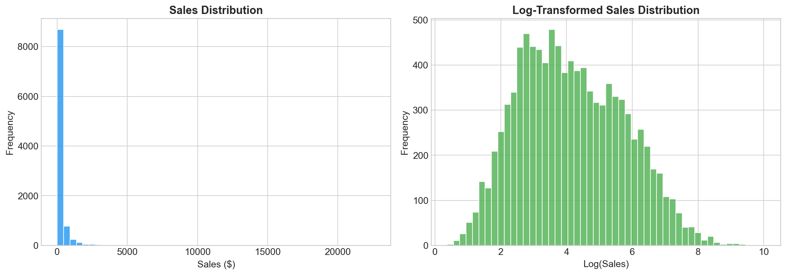

#### Sales by Category
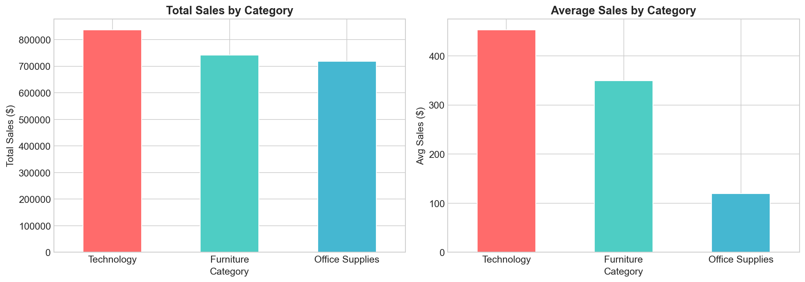

#### Sales by Region
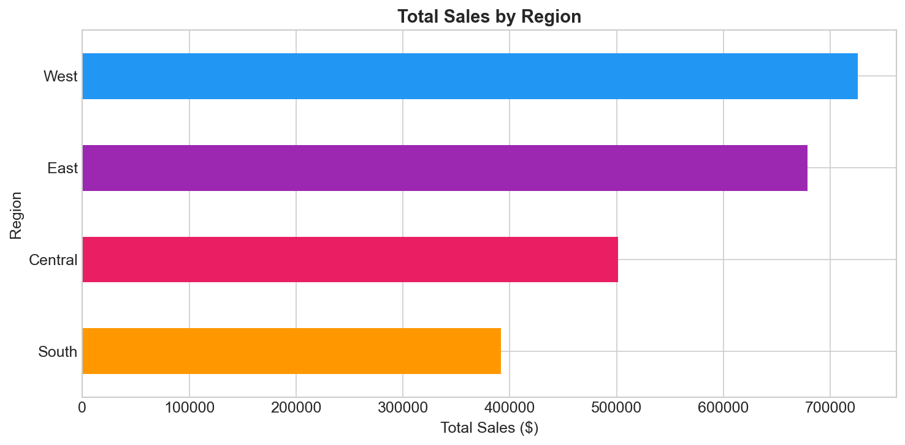

#### Monthly Sales Trend
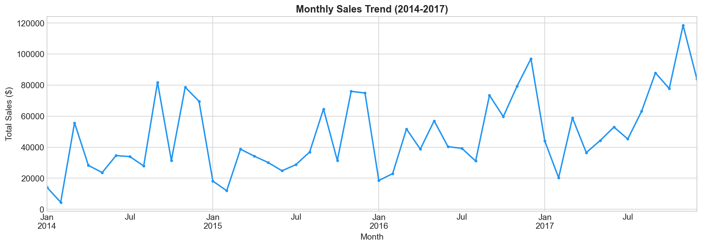

#### Correlation Heatmap
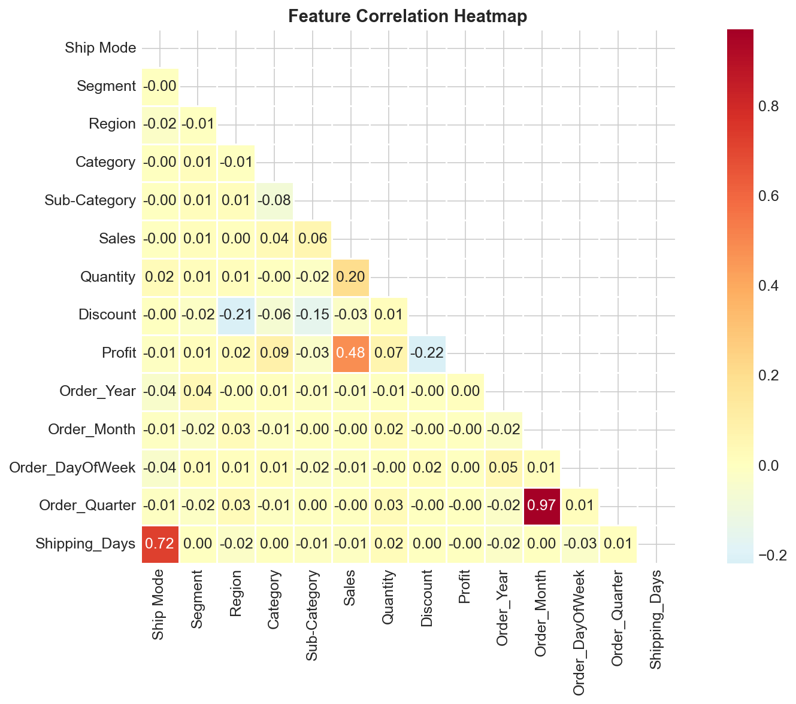

#### Sales by Segment
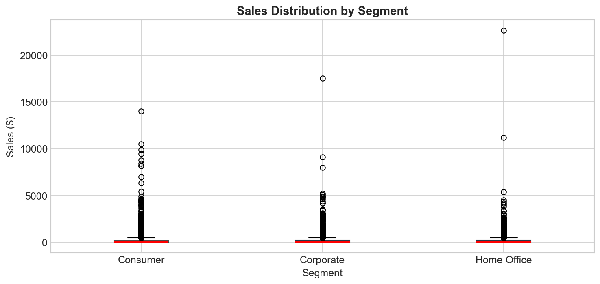

#### Top Sub-Categories
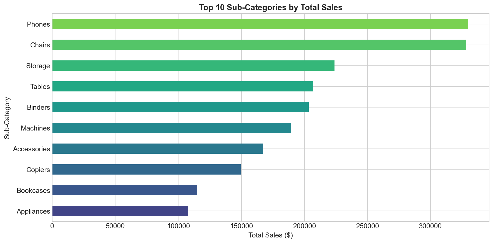

#### Quarterly Sales Trend
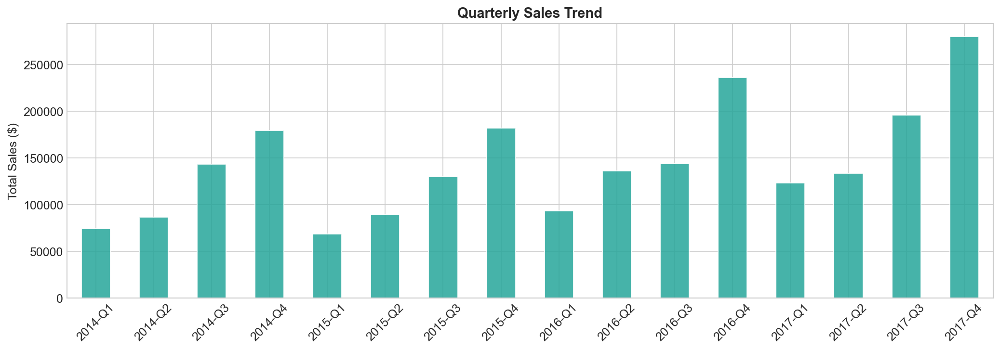

### 19.2 Model Evaluation Figures

#### Model Comparison
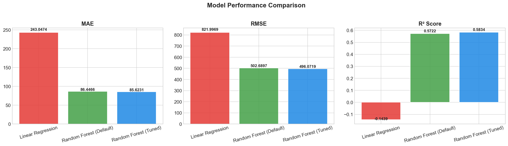

#### Actual vs Predicted
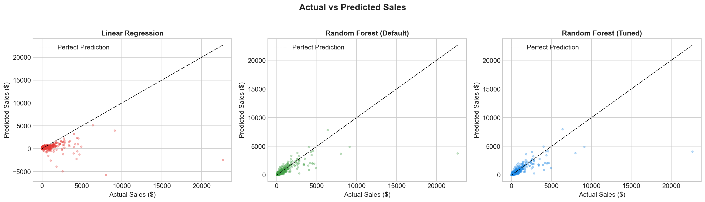

#### Feature Importance
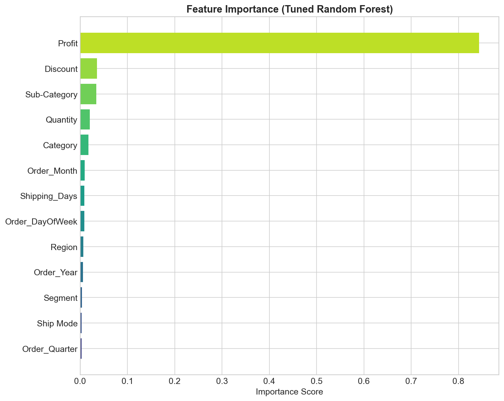

#### Residual Analysis
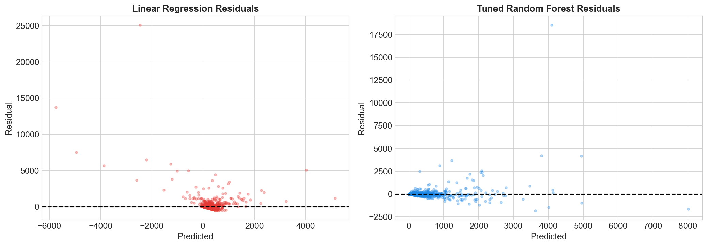

---

## 20. Frontend Dashboard

The project now includes a local browser-based dashboard in [frontend/index.html](frontend/index.html). It summarizes the dataset, highlights the tuned Random Forest results, and displays the main EDA and model diagnostic images directly in the browser.

### 20.1 How to Launch

Run the following command from the project root:

```bash
python app.py
```

The launcher starts a local HTTP server and opens the dashboard at:

```text
http://localhost:8000/frontend/index.html
```

### 20.2 What the Dashboard Shows

- Dataset summary cards with the core project numbers
- A live model comparison table sourced from `outputs/model_results/model_comparison.csv`
- A relative R² bar display for fast comparison
- An image gallery with the main EDA and model plots
- Links to the README and report for deeper documentation

---

## Appendix A: Project Structure

```
int project/
├── data/
│   └── superstore_sales.csv           # Raw dataset (9,994 × 21)
├── outputs/
│   ├── eda_plots/
│   │   ├── sales_distribution.png     # Sales histogram (raw & log)
│   │   ├── sales_by_category.png      # Category bar charts
│   │   ├── sales_by_region.png        # Region horizontal bar chart
│   │   ├── monthly_sales_trend.png    # Monthly line chart
│   │   ├── correlation_heatmap.png    # Feature correlation matrix
│   │   ├── scatter_plots.png          # Sales vs Discount/Profit
│   │   ├── sales_by_segment.png       # Segment box plots
│   │   ├── top_subcategories.png      # Top 10 sub-categories
│   │   └── quarterly_sales.png        # Quarterly bar chart
│   └── model_results/
│       ├── model_comparison.csv       # Metrics comparison table
│       ├── model_comparison.png       # MAE/RMSE/R² bar charts
│       ├── actual_vs_predicted.png    # Scatter plots (3 models)
│       ├── feature_importance.png     # Feature importance bar chart
│       └── residual_analysis.png      # Residual scatter plots
├── app.py                             # Local web server launcher
├── frontend/                          # Professional web dashboard
│   ├── index.html
│   ├── style.css
│   └── script.js
├── sales_forecasting.ipynb            # Source notebook (unexecuted)
├── sales_forecasting_executed.ipynb   # Executed notebook with outputs
├── requirements.txt                   # Python dependencies
├── README.md                          # Project overview
└── PROJECT_REPORT.md                  # This report
```

## Appendix B: Tools & Technologies

| Tool | Version | Purpose |
|------|---------|---------|
| Python | 3.12 | Core programming language |
| Pandas | ≥2.0.0 | Data loading, cleaning, manipulation |
| NumPy | ≥1.24.0 | Numerical computation |
| Scikit-learn | ≥1.3.0 | ML models, GridSearchCV, cross-validation |
| Matplotlib | ≥3.7.0 | Data and result visualisation |
| Seaborn | ≥0.12.0 | Statistical charts and heatmaps |
| Jupyter Notebook | ≥7.0.0 | Interactive development environment |
| Kaggle | — | Dataset source |

---

*Report generated as part of the Sales Forecasting ML Project.*
